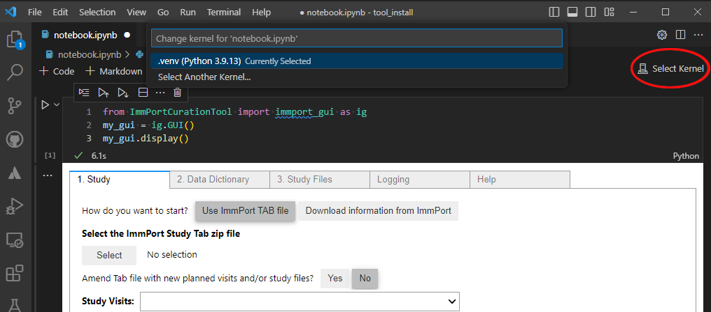

# ImmPort-Curation-Tool

## Purpose of this tool

The purpose of the ImmPort Curation Tool is to easily transform data files/tables from the study (study files) into ImmPort templates for upload and integration into the [ImmPort database](https://immport.org/shared/home). 

Currently, this tool only works to transform study files into the Assessment Template. This template covers the [Assessment Panel](https://immport.org/shared/dataModelDocumentation?table=assessment_panel) and [Assessment Components](https://immport.org/shared/dataModelDocumentation?table=assessment_component).

## User Guide
The [User Guide](./User_Guide.md) outlines:

1. [Start Tool](#step-1-start-tool)
2. [Specify Study Metadata](#step-2-specify-study-metadata)
3. [Select Data Dictionary](#step-3-select-data-dictionary)
4. [Select Directory containing Study Files](#step-4-select-directory-containing-study-files)
5. [Specify Study File metadata](#step-5-specify-study-file-metadata)
6. [Generate completed ImmPort Template](#step-6-generate-completed-immPort-template)

## Features
* Transform Study Files and Data Dictionary into completed ImmPort template files (Currently limited to Assessments)
* Validate the files during generation
  * Suggests preferred units that are more consistent within ImmPort
  * Truncates values that are too long. Alerts user of field and value that is truncated

# Installation Instructions
[TLDR for installation](#tldr-installationsetup) is at bottom.
## Pre-install
Depending on your environment, you might need to setup a virtual environment to install this module.

[Python Virtual Environments](https://docs.python.org/3/library/venv.html) help isolate python packages needed for specific tasks.

There are many ways to create a virtual environment. The default way is to run the following command

`python3 -m venv /path/to/new/virtual/environment`

By convention, most users will use "venv" or ".venv" as the "/path/to/new/virtual/environment. This creates the virtual environment in your current working directory.

If you need this tool to be more broadly shared on your computer, you can choose some shared directory that multiple users can access.

After creating the virtual environment, you need to activate it. This "activation" causes modules to be stalled in this virtual environment, and not the default python environment. Python programs run while using this virtual environment will utilize this set of installed modules.

If the command you ran above looked like:

`python3 -m venv .venv`

To activate the virtual environment on a Unix machine (Linux/Mac):

`source .venv/bin/activate`

To activate the virtual environment on a Windows machine:

`.venv\Scripts\activate`

## Installation Instructions

To install, run the following command. Note, if you are using a virtual environment, make sure you activate the virtual environment as described above.

`pip install git+http://git@github.com/JoshuaFortriede/ImmPort-Curation-Tool.git`

## Setup instructions
Once the module has been installed, run the following command in a terminal to create a notebook with a cell to run the Curation GUI.

`ImmPortCurationTool notebook`

The above command will create a Jupyter Notebook file called "notebook.ipynb". If you want to create the notebook with a specified name, run:

`ImmPortCurationTool notebook --notebook 'my_curation_notebook'`

## Running Jupyter Notebooks in Visual Studio Code
If you use VS Code to run the Jupyter Notebook, you need to install and enable the jupyter extension. To do this, open a terminal and type the following commands:

`jupyter nbextension install --user --py widgetsnbextension`

`jupyter nbextension enable --py widgetsnbextension`

## Jupyter Notebook Kernel Selection

For the tool to run in the Jupyter Notebook, you need to specify the python environment where the tool is installed. This is referred to as the "Kernel".

To do this:
1. Click on "Select Kernel" in the upper right of the VS code window (red circle).
2. If the python environment (or installation if you are not using an environment) is listed, click on it.
3. If the "kernel" is not listed, click "Select Another Kernel..." and follow steps to select or create a new environment.

> Note: Kernels are listed that are in the current PATH. As such, loading the folder that contains the python environment that you created usually works in populating the Kernel list with the environment.

>Additional documentation can be found on the [VS Code Website](https://code.visualstudio.com/docs/datascience/jupyter-kernel-management#:~:text=You%20can%20open%20the%20kernel,Notebook%3A%20Select%20Notebook%20Kernel%20command.&text=Note%3A%20In%20the%20previous%20versions,all%20available%20kernels%20by%20default.)

# TLDR: Installation/Setup

For Unix:

`python3 -m venv .venv`

`source .venv/bin/activate`

`pip install git+http://git@github.com/JoshuaFortriede/ImmPort-Curation-Tool.git`

`ImmPortCurationTool notebook --notebook 'my_curation_notebook'`

For Windows:

`python3 -m venv .venv`

`.venv\Scripts\activate`

`pip install git+http://git@github.com/JoshuaFortriede/ImmPort-Curation-Tool.git`

`ImmPortCurationTool notebook --notebook 'my_curation_notebook'`

