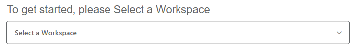
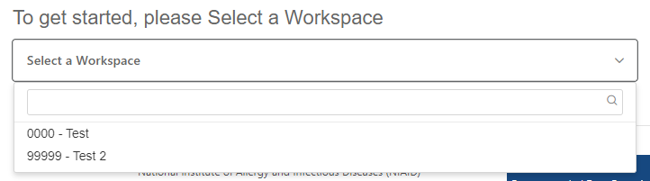

# Frequently Asked Questions

## Where do I find my ImmPort Workspace ID and study ID?
The workspace ID can be found in the [ImmPort Study Registration Wizard](https://immport.niaid.nih.gov/wizard/home). This can be found by going to the [ImmPort Website](https://www.immport.org/home), clicking on "Upload" in the top menu, and then "Study Registration". 

On this page, you will see the following section. 

Click on the "Select a Workspace" and you will see a pop-up with the workspaces you have access to. The workspace ID will be the first set of digits, with the name of the workspace being the last part.

The Study ID can be found by [searching the private data](https://immport.niaid.nih.gov/research/study/studysearchmain#!/studysearch) and then looking at the "Study Accession" column for the corresponding study. This can be found by going to the [ImmPort Website](https://www.immport.org/home), clicking on "Upload" in the top menu, and then "Search Private Data". 

## What is the "Verbatim Question"?

The verbatim question is designed to provide a more complete context to the question than just a 1 or 2 word name. There are several cases where the verbatim question is more than what is specifically listed for that question

**Compound Questions** 

 Many times there are compound questions on a collection form. For instance there might be a question of "Has the patient been treated with steroids before?" with a follow up question of "How many times?" The question "How many times?" looses context outside of the physical collection form. As such, the leading question of "Has the patient been treated with steroids before?" Should be prepended to the text "How many times?" for the verbatim question. 

**Section Header**

Sometimes a block of questions will have a section header that gives context to all the questions in the block. For instance, the header might say "What treatments were effective?". This would be followed by several questions, with a brief question text of "Oral Steroids", "Topical Steroids", "Food Elimination". In this case, the text "What treatments were effective?" should be prepended to the brief question text. 

**Matrix/Table Fields**
Sometimes questions are arranged in a matrix or table display to aid in the compactness and usability of the collection form. In this cases, the rows and columns normally contain headers that are important. For instance, there might be a table similar to the following:

Does the participant have food allergies?
<table>
<tr>
    <th></th><th>Skin Prick Test</th><th>Patch Test</th><th>Rash/Hives</th><th>Difficulty Breathing</th><th>Anaphylaxsis</th>
</tr>
<tr>
    <th>Eggs</th><td>0=Negative 1=Positive</td><td>0=Negative 1=Positive</td><td><input type='checkbox'></td><td><input type='checkbox'></td><td><input type='checkbox'></td>
</tr>
<tr>
    <th>Peanuts</th><td>0=Negative 1=Positive</td><td>0=Negative 1=Positive</td><td><input type='checkbox'></td><td><input type='checkbox'></td><td><input type='checkbox'></td>
</tr>
<tr>
    <th>Wheat</th><td>0=Negative 1=Positive</td><td>0=Negative 1=Positive</td><td><input type='checkbox'></td><td><input type='checkbox'></td><td><input type='checkbox'></td>
</tr>
<tr>
    <th>Soy</th><td>0=Negative 1=Positive</td><td>0=Negative 1=Positive</td><td><input type='checkbox'></td><td><input type='checkbox'></td><td><input type='checkbox'></td>
</tr>
</table>

In this case, each cell of the body of the table is a separate question. The row and column headers help define the question, along with the sentence above the table. A good verbatim question for the first cell could be "Does the participant have food allergies? Eggs - Skin Prick Test". This includes the context that we are look at food allergies of the participant, that we are looking at the Egg allergen and that we are using the Skin Prick Test to do this.

## Study Day: What is the difference between using the "Study Day" value in "Column Mappings", using the "Study Day" column, and using the "Age at Onset Reported" columns?

The Immport Assessment Template has two separate "Date" fields: Study Day, Age at Onset Reported/Age at Onset Unit. The Study Day field specifies the study day value for a given question. For most questions/values, this is the day of the study visit. In this case, you want to use the value of "Study Day" in the "Column Mapping" column of the data dictionary that corresponds to the question that holds the study day value. This will ensure that ALL fields from that form/instrument/panel use this value.

There are excepts where the question is asking about prior events. For instance, there might be a question of (HEADACHE)"Have you had a headache since your last visit". This might be accompanied by a follow-up question of (HEADACHE_DT) "What was the date of your last headache?" This value, in study days, can be used to populate the study day value of the first question (HEADACHE) by specifying "HEADACHE_DT" in the "Study Day" column for question "HEADACHE".

Finally, sometimes the questions are (DIABETES) "Do you have type II diabetes?" and (DIABETES_DT) "At what age were you diagnosed with diabetes?" In this case, you would use "DIABETES_DT" in the "Study Day Onset" column to specify the age of onset for this disease/condition.

## Where does the data that gets to ImmPort Template columns come from?

| ImmPort Assessment Template Column| Where the value comes from | 
| --------- | --------- | 
| Subject ID | Column Mappings: User Defined ID |
| Assessment Panel ID | Unique value generated by tool |
| Study ID | Generated by input in tool |
| Name Reported | Uses the "Description" value specified when the study files were entered into the ImmPort Study Registration system. The value is displayed in the "Description" column of the [Study File table](https://github.com/JoshuaFortriede/ImmPort-Curation-Tool/blob/master/User_Guide.md#step-5-specify-study-file-information) within this tool |
| Assessment Type | Specified in the "Assessment Name" column of the [Study File table](https://github.com/JoshuaFortriede/ImmPort-Curation-Tool/blob/master/User_Guide.md#step-5-specify-study-file-information) within this tool |
| Status | [NA] |
| CRF File Names | Automatically generate by tool based on study files selected |
| User Defined ID | [Unique value generated by tool] |
| Planned Visit ID | Data Dictionary: Column Mappings: Visit | 
| Name Reported | Data Dictionary: Field Description |
| Study Day | Data Dictionary: Column Mappings: Study Day  OR  Override Study Day |
| Age at Onset Reported | Data Dictionary: Age at Onset Reported  | 
| Age at Onset Unit Reported | Data Dictionary: Age at Onset Unit Reported |
| Is Clinically Significant | [NA]  | 
| Location of Finding Reported  | Data Dictionary: Location  | 
| Organ or Body System Reported  | [NA]  | 
| Result Value Reported  | [Value from Study File]  | 
| Result Unit Reported  | Data Dictionary: Unit | 
| Result Value Category  | [NA]  | 
| Subject Position Reported  | [NA]  | 
| Time of Day  | [NA]  | 
| Verbatim Question  | Data Dictionary: Verbatim Question  | 
| Who is Assessed  | Data Dictionary: Who is Assessed  | 
