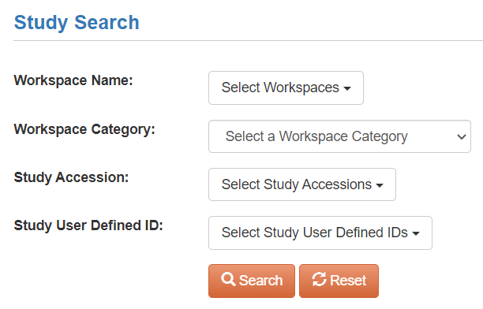
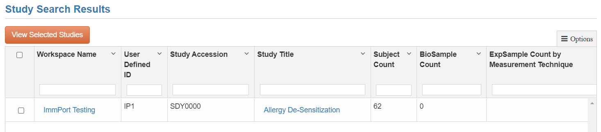
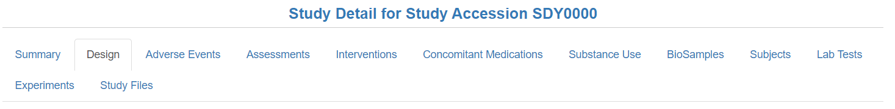
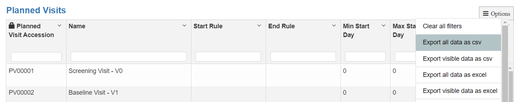
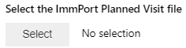
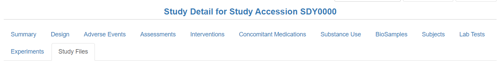
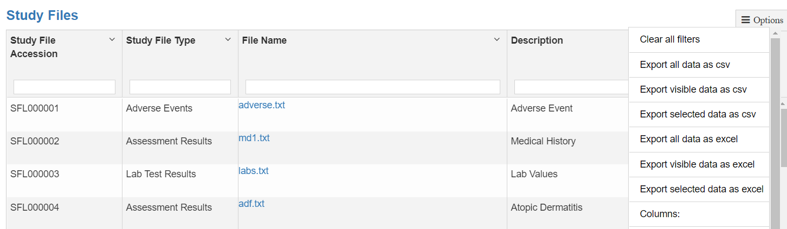
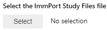

# Load Study Data from ImmPort

1. Go to the [ImmPort Studies Search Page](https://immport.niaid.nih.gov/research/study/studysearchmain#!/studysearch). You will need to be logged in. 

2. In the "Study Accession" dropdown field, select the ImmPort Study you are working with.
3. Click "Search" to narrow the Study Results Table to the study that you have selected. Alternatively, you can find the Study in the Study Results Table, or you can enter the ImmPort Study ID (i.e. SDY0000) in the "Study Accession" field in the header of the Study Search Results table. 
4. Find the row in the Study Search Results table for the ImmPort Study, and click the link in the "Study Title" column.

## Planned Visits
To download the current study files table with ImmPort accession numbers, after following the [steps above](./Load_files_from_immport.md#load-study-data-from-immport):

1. Click on the "Design" tab.

2. Scroll down to the "Planned Visits" table
3. Click on the "Options" button in the top-right of the table.

4. Click on "Export all data as csv"
5. Use this file with the Planned Visits file selector.

## Study Files

To download the current study files table with ImmPort accession numbers, after following the [steps above](./Load_files_from_immport.md#load-study-data-from-immport):

1. Click on the "Study Files" tab.

2. Scroll down to the "Study Files" table
3. Click on the "Options" button in the top-right of the table.

4. Click on "Export all data as csv"
5. Use this file with the Study Files file selector. 

