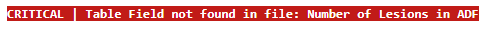
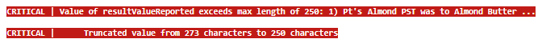
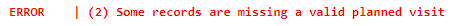
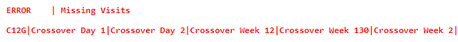
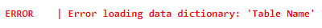
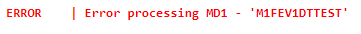
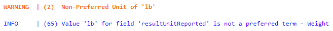

# Logging Tab
The Logging tab provides helpful information regarding different errors that might occur while using this tool. Common errors are explained below and fall under three categories:

* [Critical](#critical)
* [Error](#errors)
* [Warning](#warnings)

## Critical
Critical problems indicate a problem with the data and should be addressed. 
### Table Field not found in file

This error happens when the dictionary specifies a field that is not present in the study file. In this case, it is specifying that the study file associated with "ADF" is missing a field called "Number of Lesions".

To fix, there are multiple solutions. If the field should not be processed, put the value "[NA]" in the "Column Mappings" column of the data dictionary for this field. If the field should be processed, ensure that the column is present in the study file, and the "Field Name" from the Data Dictionary matches the column heading in the study file. 

### Truncated Value

This error happens when the study files are being processed. It indicates that a field exceeds the maximum limit of the ImmPort field, and that it has automatically been truncated to the allowed length, along with having the text "[Truncated]" prepended to the text to signify to data users that the field has been truncated.

The error specifies the ImmPort field that is affected, the maximum length of that field, the beginning of the text that was truncated, and the length of the field prior to truncation. In this example:
* ImmPort Field is "resultValueReported"
* Maximum length of the field is 250
* The beginning of the text was "1) PT's Almond PST was to Almond Butter"
* The original field was 273 characters.

The text is provided to help identify the invalid value, and allow for pre-processing of it, if necessary, to decrease the length of the value. This is not necessary as the value is automatically truncated, however the truncated data might be valuable, and other methods could be considered to reduce the length of the response while keeping the most important information.

## Errors
Errors indicate something unexpected has happened and the corresponding function has not finished successfully. Errors need to be addressed, and the last user action should be redone. Most errors will occur when generating the template files. 

### Planned Visit is Missing

This error occurs during data validation and specifies that there are record(s) that do not have a planned visit value. 

To fix, check if there are any missing visits (specified below). If there are no missing visits, it is possible that the source file has no value in the visit column. If the study file has no visit column, and all records in the study file should be from a single visit, use the directions specified in sub-step 4 of [Step 5: Specify Study File metadata](./README.md#step-5-specify-study-file-metadata).

### Missing Visits

This error happens during data processing and identifies that the data contains planned visit values that are not specified in the data dictionary. 

To fix, either update the "Code List Values" column in the data dictionary to include the extra visits, or use the "Map to Visit" column to specify the additional mappings. Information about using these fields can be found in [Instructions for Curating the Data Dictionary](./Curated_Data_Dictionary.md).

### Error loading data dictionary

This error happens when trying to load a data dictionary that does not meet the specifications outlined in [Instructions for Curating the Data Dictionary](./Curated_Data_Dictionary.md).

To fix, make sure you are 1) selecting a data dictionary, and 2) that the data dictionary is formatted as specified.

### Error processing ...

This error happens during study file processing and is a somewhat general error. It should specify the "Table Code" of the study file being processed, and then some information about the error. In this instance, the error is specifying that a field with the code of 'M1FEVDTTEST' is not being found.

To fix this, check the data dictionary to ensure that all fields, including referenced fields in columns such as "Study Day","Unit", etc are valid fields.

## Warnings
Warnings are notifications that something is not ideal, but is acceptable. These warnings do not need to be addressed, but can be if desired.

### Non-Preferred Unit

This warning happens during study file processing. It specifies that the unit used for the specified question is not a preferred unit for the specified ImmPort Field. In this instance, the unit "lb" is not the preferred unit for the ImmPort field "resultUnitReported". The question from the study file was "Weight".

