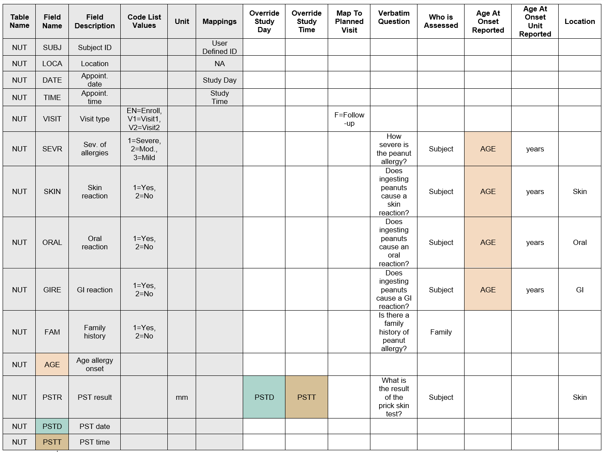

# Preparing and Preprocessing Files
The curation application requires 3 different types of files:
1)	ImmPort Files 
2)	Curated Data Dictionary
3)	Study files 

## Generating ImmPort Files
Before generating the *Lab Tests* and *Assessments* templates, you must first gather or create the required ImmPort templates.
The ImmPort files should either be in TXT or CSV format. They can be uploaded separately or in a single ZIP file.

If Using a Study Already Published in ImmPort:
- The file that ends with *_Tab.zip* should be downloaded. That file should already contain the 3 required templates, study_data.txt, planned_visit.txt, and protocol.txt.

If the Study Has Not Yet Been Deposited in ImmPort
- An ImmPort account should be created and a new study registered. The Study Registration Wizard will walk the user through filling basic study information, which will encompass details about the protocol(s), study data, and planned visits.
- Alternatively, the basic_study_design.txt and protocols.txt can be completed and uploaded into ImmPort. 

Ultimately, both methods will create the required 3 files – study_data.txt, planned_visit.txt, and protocol.txt. Each file can be uploaded into the curation application. Alternatively, all 3 files can be uploaded at once as the *_Tab.zip*. 
If any of these files contain incomplete or incorrect information, update them directly in ImmPort before generating the filled *Lab Tests* and *Assessments* templates.

### Example ImmPort Files
Below are examples of the ImmPort files that are required by the Curation tool. The templates are populated with mock data to showcase the required formatting.

#### *study_data.txt*
| **STUDY_FILE_ACCESSION** | **DESCRIPTION**     | **FILE_NAME**        | **STUDY_ACCESSION** | **STUDY_FILE_TYPE** | **WORKSPACE_ID** |
|--------------------------|---------------------|----------------------|---------------------|---------------------|------------------|
| SFL19620624              | ABC Test            | ABC-Test.txt         | SDY818199           | Lab Test            | 18888            |
| SFL19620625              | XYZ Test            | XYZ-Test.txt         | SDY818199           | Lab Test            | 18888            |
| SFL19620626              | Medical History     | Med-History.txt      | SDY818199           | Assessment          | 18888            |
| SFL19620627              | Family History      | Fam-History.txt      | SDY818199           | Assessment          | 18888            |
| SFL19620628              | Physical Exam       | Physical-Exam.txt    | SDY818199           | Assessment          | 18888            |

#### *protocol.txt*
| **PROTOCOL_ACCESSION** | **DESCRIPTION**        | **FILE_NAME**                    | **NAME**           | **ORIGINAL_FILE_NAME**     | **TYPE** | **WORKSPACE_ID** |
|------------------------|------------------------|----------------------------------|--------------------|-----------------------------|----------|------------------|
| PTL19950818            | ABC Test Protocol      | ABC-protocol.PTL19950818.pdf     | ABC Protocol       | ABC-protocol.pdf           | Assay    | 18888            |
| PTL19950819            | Study Protocol         | Study-protocol.PTL19950819.pdf   | Study Protocol     | Study-protocol.pdf         | Study    | 18888            |

#### *planned_visit.txt*
| **PLANNED_VISIT_ACCESSION** | **END_RULE** | **MAX_START_DAY** | **MIN_START_DAY** | **NAME**  | **ORDER_NUMBER** | **PERIOD_ACCESSION** | **START_RULE** | **STUDY_ACCESSION** | **WORKSPACE_ID** |
|-----------------------------|--------------|--------------------|--------------------|----------|------------------|----------------------|----------------|---------------------|------------------|
| PV8199556                   | NA           | 0                  | 0                  | Enroll   | 1                | P05281998            | NA             | SDY818199           | 18888            |
| PV8199557                   | NA           | 6                  | 1                  | Visit 1  | 2                | P05281998            | NA             | SDY818199           | 18888            |
| PV8199558                   | NA           | 21                 | 15                 | Visit 2  | 3                | P05281998            | NA             | SDY818199           | 18888            |

## Curating the Data Dictionary
The tool also requires a data dictionary that has been curated to conform to certain standards. This data dictionary links variables in the study files to fields in the *Assessments* and *Lab Tests* templates. While many clinical trials already include a data dictionary, some additional curation is required for use with this tool.
The data dictionary should either be a TXT or CSV file.
### Required Columns
The first six columns are required and must be present in the curated data dictionary. However, the last three (Code List Values, Mapping, and Unit) only need to be filled in when relevant. For example, if a field has no coded values or a unit, those cells can be left blank.

| **Column Name**       | **Purpose**                                                            | **Format**                                                                                                                                      | **Examples**                                                                 |
|-----------------------|------------------------------------------------------------------------|--------------------------------------------------------------------------------------------------------------------------------------------------|-------------------------------------------------------------------------------|
| Table Name            | Identifies the source study file.                                      | A string that represents the study file                                                                                                          | VIT, MED, CBC                                                                 |
| Field Name            | Specifies the column within that file.                                 | A string that is in the study file                                                                                                               | BLOPR, HEIG, WEIG                                                             |
| Field Description     | Provides a human-readable description of the variable.                 | Any string that describes the Field Name                                                                                                         | Blood pressure, Height, Weight                                               |
| Code List Values      | Defines mappings for coded responses. (e.g., 1 = Yes, 2 = No).         | Format is a=A, b=B, c=C, ... where lowercase letters (values on left) are the coded values present in the data files and uppercase on the right | 1=Normal, 2=High, 3=Low, 4=Unknown                                           |
| Mapping               | Specifies the variable’s role in the study.                            | This can be 1 of 6 options: User Defined ID, Study Day, Study Time, Visit, Category, NA[ℹ️1]                                                      | User Defined ID, Visit, NA                                                   |
| Unit                  | Defines the unit for the variable.                                     | This can be a string, another Field Name that contains the unit, or [SPLIT][ℹ️2] if the recorded value contains the unit.                         | Percentage, HEIGHTUNIT, [SPLIT]                                              |

#### Guidelines for Completing the Mapping Column
[ℹ️1]: The Mapping column can be filled in by 1 of 6 options or left empty entirely. User Defined ID should be used to indicate the Field Name that contains the participant ID. Visit should be used to indicate the Field Name that contains the specific visit information. Study Day should be used to indicate the day or date, while Study Time should be used to indicate the time. All of these designations should only be used a maximum of 1 time per Table Name. If there are multiple study days or times represented within a table, Override Study Day and Override Study Time should be used (see below).

The other options, NA and Category, can be used more than once per Table Name. NA should be used to indicate that the Field Name should be ignored entirely from the completed Lab Tests or Assessments template. For example, if a Field Name is only used for internal record keeping and is meaningless to external researchers, then that Field Name should be designated as NA.

Category should be used when that Field Name does not contain a result per se, but rather a category that adds specificity to the results. That value will then be added to all of the Field Descriptions for that Table Code instead of being listed as a result in the final template. For example, consider a Field Name that is SKPT with a Field Description of skin prick test result and with values in the study file containing those result measurements (e.g., 1, 3, 0, 4). Consider another Field Name for that table is ALLER with a Field Description of allergens, containing different types of allergens in the study file (e.g., peanut, pollen, milk). The ALLER field might be better designated as Category. That would then make the Field Description of SKPT peanut skin prick test result, pollen skin prick test result, milk skin prick test, etc. 

#### Designating SPLIT in the Unit Column 
[ℹ️2]: [SPLIT] or SPLIT can be designated in the Unit column if the recorded value contains the unit. Designating SPLIT will split at the first space, placing everything before the space as the value and everything after as the unit. For example, ‘6 feet’ will designate the unit as ‘feet’, while ‘6feet’ will result in no unit designation.  

### Optional Columns
The next eight columns are optional, but filling them in when relevant improves the quality and reusability of the generated data. Map To Visit, Override Study Day, and Override Study Time allow you to override information specified in the mandatory columns for more granular control. 
The remaining five columns – Verbatim Question, Who is Assessed, Age at Onset Reported, Age at Onset Unit Reported, and Location – are only used to generate the *Assessments* template. These do not need to be included for study files that will be used exclusively for generating the *Lab Tests* template.

| **Column Name**                 | **Purpose**                                                                                                                                                                                                                                                                                                  | **Format**                                                                                                                                                                                                                                                                      | **Examples**                                                                                                             |
|--------------------------------|--------------------------------------------------------------------------------------------------------------------------------------------------------------------------------------------------------------------------------------------------------------------------------------------------------------|----------------------------------------------------------------------------------------------------------------------------------------------------------------------------------------------------------------------------------------------------------------------------------|--------------------------------------------------------------------------------------------------------------------------|
| Map To Visit                   | Provides visit information present in the study file but missing from planned_visit.txt. Use this if additional visits need to be incorporated into the templates.                                                                                                                                        | JSON dictionary where the key (value before the colon) is the decoded visit name and the value (value after the colon) is the name of the visit from the planned visits file. [ℹ️3]                                                                                                 | {"Visit 0":"Baseline", "Visit 12": "Week 12"}                                                                           |
| Override Study Day             | Allows a specific day/date to be assigned when different columns in the same study file refer to different time dates.                                                                                                                                                                                       | A date or another Field Name that contains the study day. [ℹ️4]                                                                                                                                                                                                                      | December 15, 2021, 3/2/5, LABDAY                                                                                  |
| Override Study Time            | Similar to Override Study Day, but for time values. Can contain a fixed time, a numeric value, or reference another field.                                                                                                                                                                                  | A time or another Field Name that contains the study time. [ℹ️5]                                                                                                                                                                                                                    | Morning, 12:30 PM, LABTIME                                                                                        |
| Verbatim Question              | The exact case report form question wording.                                                                                                                                                                                                                                                                 | Any string                                                                                                                                                                                                                                                                       | What was the height?, What was the result of the pregnancy test?, Was there a major deviation?                   |
| Who is Assessed                | Identifies the subject assessed.                                                                                                                                                                                                                                                                              | This can be a string or another Field Name that contains the person.                                                                                                                                                                                                             | Subject, Mother, FAMMEM                                                                                           |
| Age at Onset Reported          | Numeric age of onset.                                                                                                                                                                                                                                                                                         | This can be a number or another Field Name that contains the age.                                                                                                                                                                                                                | 15, 4, AGEONSET                                                                                                   |
| Age at Onset Unit Reported     | Unit for age of onset.                                                                                                                                                                                                                                                                                        | This can be a string or another Field Name that contains the unit.                                                                                                                                                                                                               | Years, Months, AGEUNIT                                                                                           |
| Location                       | The body location that is relevant to the field.                                                                                                                                                                                                                                                              | A string that represents an anatomical site, organ, or body system, or another Field Name that contains the location.                                                                                                                                                            | Back, Skin, Respiratory system                                                                                   |

[ℹ️3] If the visit value from the study file — or its decoded value from a code list — does not exactly match a visit name in the planned visits file, you can provide a mapping using a JSON dictionary format. The format is: `{"[Study_file_visit_value]": "[Planned_visit_file_value]"}`.

[ℹ️4] This takes precedence over assigning the study day as the Field Name that was designated as Study Day in the Mappings column. For example, if there was a medical history form with two related questions: *What was the severity of your last latex reaction?* and *What was the date of the latex reaction?* — the second could be used as the Override Study Day.

[ℹ️5] This works in the same manner as Override Study Day, only with study time. Specifically, it takes precedence over assigning the study time as the Field Name that was designated as Study Time in the Mappings column.

### Example Data Dictionary
Below is an example of a curated data dictionary populated with mock data to illustrate the required formatting.
- Grey shaded columns are required
- Peach, teal, and tan cells indicate values that are mapped from entries listed in the Field Name column.

  

## Gathering Study Files
Finally, the tool requires study files that are specific to each clinical trial. These files should contain participant-level information that was collected during the study. Each file should correspond to a specific domain (e.g., demographics) and typically represent a specific CRF. All study files should contain columns representing variables (e.g., subject ID, visit date, measurement values) that are also represented in the curated data dictionary.
Each study file should either be in TXT or CSV format. All study files should be in a single folder, which will be chosen within the application interface. 

### Example Study Files
Below is an example of a study file that aligns with the example data dictionary above.

| SUBJ | LOCA     | DATE  | TIME  | VISIT | SEVR | SKIN | ORAL | GIRE | FAM | AGE | PSTR | PSTD | PSTT |
|------|----------|-------|-------|-------|------|------|------|------|-----|-----|------|------|------|
| S1   | Clinic A | 1/5   | 10:00 | V1    | 1    | 1    | 1    | 1    | 2   | 2   | 3    | 1/5  | 12:00 |
| S2   | Clinic A | 1/13  | 11:20 | V1    | 2    | 1    | 1    | 1    | 1   | 5   | 2    | 1/13 | 12:30 |
| S3   | Clinic A | 1/21  | 11:30 | V1    | 2    | 2    | 2    | 1    | 1   | 3   | 3    | 1/21 | 1:15  |
| S4   | Clinic B | 2/3   | 9:00  | V1    | 2    | 1    | 2    | 2    | 2   | 4   | 0    | 2/3  | 1:30  |
| S5   | Clinic B | 1/5   | 10:30 | V1    | 3    | 2    | 1    | 2    | 1   | 6   | 0    | 1/5  | 2:00  |
| S6   | Clinic B | 2/4   | 10:45 | V1    | 1    | 2    | 1    | 1    | 1   | 4   | 1    | 2/4  | 2:00  |
| SY   | Clinic A | 1/5   | 1:30  | V1    | 3    | 1    | 2    | 1    | 2   | 7   | 2    | 1/5  | 3:30  |
| S8   | Clinic A | 1/14  | 15:00 | V1    | 2    | 1    | 1    | 1    | 1   | 9   | 2    | 1/14 | 10:45 |
| S9   | Clinic A | 1/28  | 10:30 | V1    | 1    | 1    | 1    | 1    | 1   | 2   | 5    | 1/28 | 3:45  |
| S10  | Clinic B | 1/8   | 11:45 | V1    | 1    | 1    | 2    | 2    | 1   | 5   | 3    | 1/8  | 4:30  |

