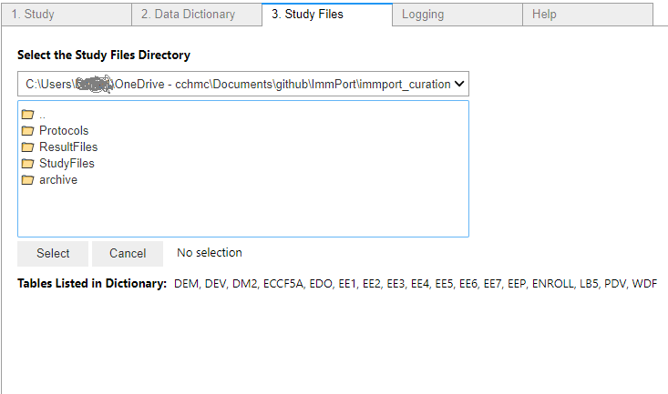
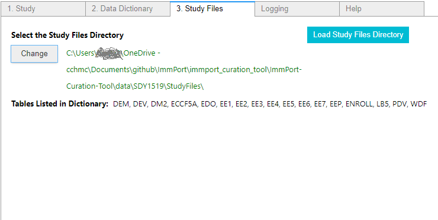
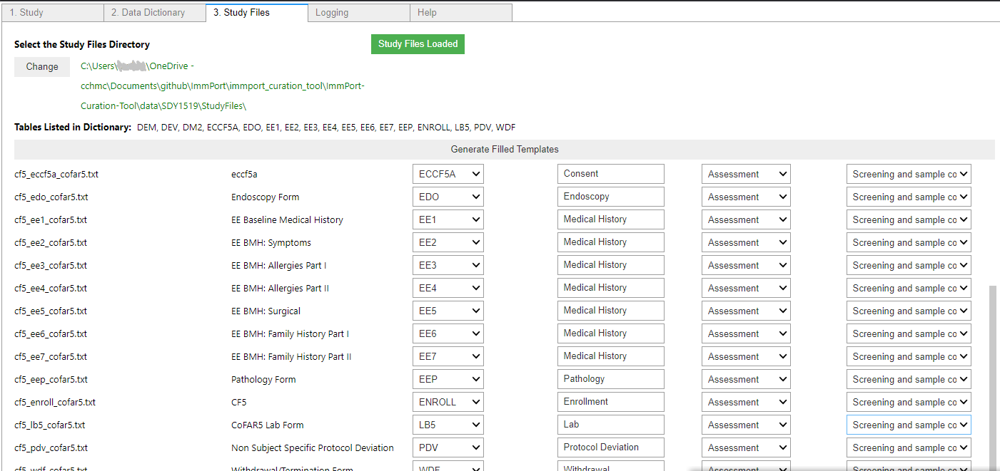

# ImmPort-Curation-Tool User Guide

The purpose of this user guide is to explain how to use the ImmPort Curation Tool.

## Other documentation
* [Installation Instructions](../README.md#installation-instructions)
* [Purpose of the tool](../README.md#purpose-of-this-tool)
## General Overview of Steps
0. Run the notebook cell to initiate the tool
1. Specify the ImmPort study you are working on
2. Specify the [curated Data Dictionary](./Curated_Data_Dictionary.md) for this study.
3. Specify the directory containing the study files.
4. Curate the generated table with necessary data
5. Generate filled template files

## List of Necessary files and the steps that require them
1. zipped study tab file (Step 1)
    (only relevant if this is curation upon a previously submitted dataset)
2. study visits file (Step 1)
3. ImmPort Study Files (Step 1)
Run the notebook cell to initiate the tool

## 1. Study
Here is an image of the study tab as it first appears. 

The application needs a source of study data which can be one of two things:

### 1. a zipped TAB file already present in your directories (default)...
    here's documentation about how to get the tab file _____

### 2. if the data is not already submitted and published fully, a tab file is not avaialable, and you will certainly the accessed by specifying it's location in ImmPort
    if b) you'll need your workspace name: This can be found by  ______ 

Select your file by browsing under the select button

First, download the study visits file with the instructions here: [More Instructions](https://github.com/JoshuaFortriede/ImmPort-Curation-Tool/blob/develop/documentation/Load_files_from_immport.md)

Modify the visits table then select it from the appropriate location
(this may require communication with the ImmPort DB admins to create the visit entity)

Download ImmPort Study Files file using the same instructions [More Instructions](https://github.com/JoshuaFortriede/ImmPort-Curation-Tool/blob/develop/documentation/Load_files_from_immport.md) and select the correct file

____ josh the above two files weren't in it when I worked with this before

Now switch to the Data Dictionary Tab

## 2 Data Dictionary
First, curate the data dictionary according to [these instructions](https://github.com/JoshuaFortriede/ImmPort-Curation-Tool/blob/develop/documentation/Curated_Data_Dictionary.md) ______ and save it to your directory

Then click select, browse to the correct file and re-click select

Click through, then specify which column in DD holds the table name code

## 3 Specify Directory
Switch to the Study Files Tab

10 alt

11

13

14

15

16

17

18

19

20

## 4 Fill out the table
placeholder
## 5 Run to create files
Once your configuration is set.  Press the gray button to launch the exporter

## 6 You're now done with the tool, use the outputs on the ImmPort site
Login to Immport and try to validate them

If validation comes back OK, goto the upload

Further Edits and questions
____ kevin needs to smudge out his children's ID

I don't think it will benefit the user, but the documenter really wants "clear" functionality akin to a "back" button. once you click something it's really hard to screen cap

are the assessment type text, visit type etc. required?

Check for any critical errors in the logging tab

Check that these files have been created _______

I still think the default visit column header doesn't make a lot of sense