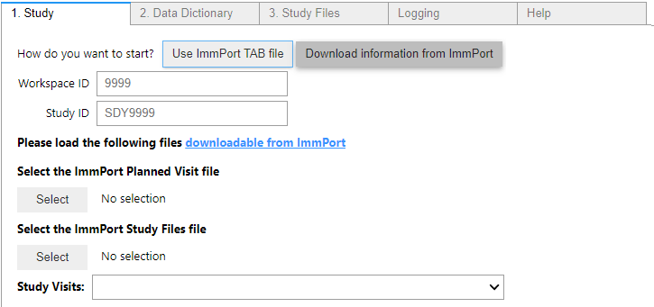

# ImmPort-Curation-Tool User Guide

The purpose of this user guide is to explain how to use the ImmPort Curation Tool.

## Other documentation
* [Installation Instructions](../README.md#installation-instructions)
* [Purpose of the tool](../README.md#purpose-of-this-tool)

## Before You Start
Before you start using this tool, you will need to:
- [Install the tool](../README.md#installation-instructions)
- Have the study files you want to convert in a single directory
- [Curate the data dictionary](./Curated_Data_Dictionary.md)

## General Overview of Steps
1. [Start Tool](./README.md#step-1-start-tool)
2. [Specify Study Metadata](./README.md#step-2-specify-study-metadata)
3. [Select Data Dictionary](./README.md#step-3-select-data-dictionary)
4. [Select Directory containing Study Files](./README.md#step-4-select-directory-containing-study-files)
5. [Specify Study File metadata](./README.md#step-5-specify-study-file-metadata)
6. [Generate completed ImmPort Template](./README.md#step-6-generate-completed-immPort-template)

## Step 1: Start Tool
Open up the jupyter notebook: forms.ipynb

Run the first notebook cell to initiate the tool.

You should not see an output that looks like this.

## Step 2: Specify Study Metadata
There are 2 methods to specify study metadata, specified by clicking the buttons next to the text "How do you want to start?".
### Method 1: Use ImmPort TAB file
A valid ImmPort TAB file can be downloaded from the [ImmPort Data Browser](https://www.immport.org/browser). Search for the Study ID that you are looking for, click to open the study folder, and download the _Tab.zip file.  

Select your file by browsing under the select button

> Note: The ImmPort TAB file includes study metadata as well as information for the planned visits and study files. If you need to update these, [follow these instructions](./Load_files_from_immport.md).

### Method 2: Download information from ImmPort
If you cannot get a valid TAB file (perhaps this is the intial upload of the study and its not present), then the process is a little more manual.

First, specify the workspace ID and the study ID.

Next provide a valid ImmPort Planned Visit file and a valid ImmPort Study Files file. Instructions for obtaining these files are provided in the tool, as well as [here](./Load_files_from_immport.md)

Now switch to the Data Dictionary Tab

## Step 3. Select Data Dictionary
First, curate the data dictionary according to [these instructions](./Curated_Data_Dictionary.md) and save it to your directory

Then click select, browse to the correct file and re-click select

Click through, then specify which column in DD holds the table name code

## Step 4. Select Directory containing Study Files
Switch to the Study Files Tab and select the folder that contains the study files.
> Note: This is selecting a folder, not individual files. you should not see any files in this selector.

Once you've selected the correct folder, make sure to click the Load Study Files Directory

The list of tables was already specified in and interpretted throuh the curated data dictionary file previously loaded. The list of tables from the data dictionary will display automatically, but a list of files to curate with those specified table names will only appear if you've selected the correct directory. Below are examples of incorrect and correct directory selections are below:

Incorrect:

Correct: 

## Step 5. Specify Study File metadata
The generated table includes every file in the selected "Study Files" directory. For each file that you want to process:

1. Assign the table code the coorelates this study file with the entries in the Data Dictionary

2. Add an assessment name such as Medical History or Demographics. This assessment name should be a high-level, broad description. This will become the assessment type in the ImmPort Data Model

3. Select the ImmPort Template to which the tool should munge the files. Currently this tool only supports Assessments so pick that for each file to translate

4. If the data dictionary does not specific a visit field for this study file, specify the default visit. This default visit will be applied to every record in this study file.

## Step 6. Generate completed ImmPort Template
Once your configuration is set.  Press the gray button to launch the exporter: press the Generate Filled Templates Button.

Depending on the size of the study files, this step could take a few minutes. The button displays the current table code of the study file that is being processed.

You can also view the progress by clicking on the "Logging" tab. This tab display information about the process, and more importantly, any errors that occurring. Errors are specified in red and should provide specifics about the error. 

## Step 7: Upload files to ImmPort
The generated files will be in the results/SDY#### directory, with a naming format of SDY####/[Table Code]. Both the ImmPort wide-format txt file, as well as a JSON file is generated. Additionally, the original study file and wide-format text file is included in a ZIP file. This ZIP file is one method of uploading the data to ImmPort, and ensures that the correct study file is uploaded with the correct completed ImmPort Template file.

It is recommended to use the ImmPort validator on at least one study file and template to check for any validation errors in the uploads, prior to using the actual uploader.

