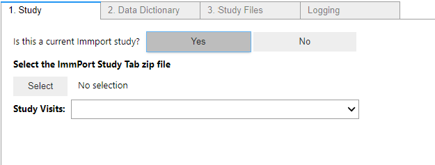

# ImmPort-Curation-Tool User Guide

The purpose of this user guide is to explain how to use the ImmPort Curation Tool.

## Other documentation
* [Installation Instructions](../README.md#installation-instructions)
* [Purpose of the tool](../README.md#purpose-of-this-tool)
## General Overview of Steps
1. Specify the ImmPort study you are working on
2. Specify the [curated Data Dictionary](./Curated_Data_Dictionary.md) for this study.
3. Specify the directory containing the study files.
4. Curate the generated table with necessary data
5. Generate filled template files

## Study
Here is an image of the study tab

